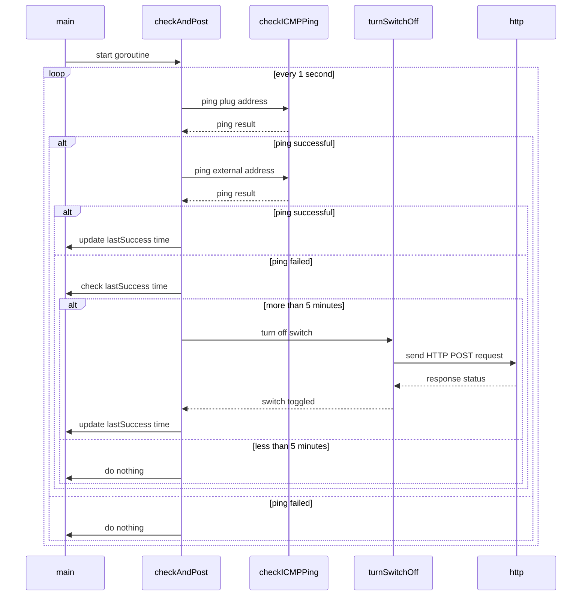

# networHealthWatch

A simple Go lang program to restart my router when not connected to the internet for a while

Not sure why, my network is getting sometimes in a dumb state where
the solution is to restart my Google WiFi main device.

There is a plug with ESPhome firmware to which the device is connected.

If the server running this program can still ping the plug, but can't ping an external
IP address like 8.8.8.8, and this situation remains for 5 minutes, it will use the ESPhome
API to turn the router off.

The plug is programmed to turn itself on after a short time, if turned off
by any circumstance (manual button press, power loss, etc.)

### Overview

### Requirements

Needs a working go installation to build from source.  Compiled binary is self-contained, 
and is around 7M in size on a Mac M1

### Environment variables

Can be provided by shell on call, or written to a .env file.

The file `sample-dot-env` provided shows the required variables.

